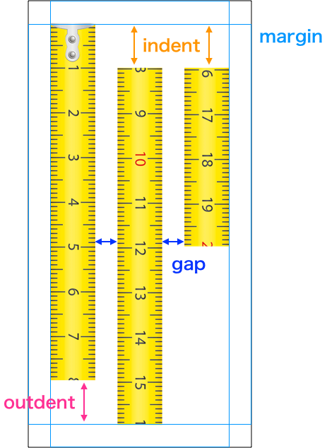

Columinizes tall image like a web page screenshot to easy to see on PC screen.

Using [sharp](https://www.npmjs.com/package/sharp) to operate images.

# Example

```javascript
const { ImageColumnizer } = require('sharp-columnizer')

(async() {
  const src = ImageColumnizer.openImageFile('screenshot.png')
  const columinizer = new ImageColumnizer({
    margin: ImageColumnizer.margin(50, 50, 50, 50), // top, right, bottom, left: default 0
    maxColunns: 2, // less than 1 means Infinity
    gap: 50, // default 0
    align: 'bottom', // default: 'top'
    indent: 100, // default 0
    outdent: 100, // default 0
    backgroundColor: '#fff', // default '#0000' // black + alpha0,
    borderWidth: 1, // default: 0 // no border
    borderColor: '#000', // default: '#000' // black
  })
  const dest = await columnizer.composite()
  // dest is sharp image (https://www.npmjs.com/package/sharp)
  await dest.png().toFile('columnized.png')
})()
```

# Options

